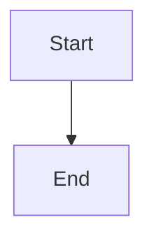

# 🚀 md-to-pdf by AI SmartTalk

**A powerful fork of the original md-to-pdf with advanced features for professional document generation.**

This enhanced version, maintained by [AI SmartTalk](https://aismarttalk.tech), extends the original markdown-to-PDF converter with sophisticated features including customizable headers/footers and intelligent content censoring capabilities.

## ✨ Enhanced Features

- **🔒 Document Censoring:** Remove confidential sections — the hidden text never reaches the PDF
- **🎨 Themes:** Named, versioned brand kits (`aismarttalk`, `report`, `minimal`) with optional cover pages
- **📊 Charts & Diagrams:** ` ```chart ` and ` ```mermaid ` fenced blocks become inline SVG
- **📐 Layout Doctor:** Audit a PDF for overflow, blank pages, orphan headings and split tables — and fix them
- **🖍️ Redaction:** `POST /api/redact` paints out patterns and PII, then rebuilds the pages from pixels
- **🔬 Visual diff:** `POST /api/diff` compares two renders pixel by pixel, for CI
- **📄 Customizable Headers & Footers:** Apply professional templates to your documents
- **🔄 Multiple PDF Engines:** Support for Weasyprint, Wkhtmltopdf, and Pdflatex
- **📚 Guides:** Twelve example-driven guides served by the engine itself at `#/guides`,
  in English and French, each linking straight into the test console

## 🔍 How to Use Document Censoring

Easily hide sensitive information in your PDFs with our censoring feature:

```markdown
# Document with Confidential Information

## Public Section
This content will remain visible to everyone.

## Restricted Information
{{CENSOR}}

## Conclusion
Back to publicly visible content.
```

The historical point tag can be written `{{CENSOR}}`, `<CENSOR>`, `{{ CENSOR }}`,
`{{CENSOR }}` or `{{ CENSOR}}`. It renders exactly what it always rendered.

Regions are the modern form. Whatever the syntax, the censored text is **removed** before
pandoc sees it: it cannot be selected, searched or extracted from the resulting PDF.

| Tag                                | Effect                                                        |
|------------------------------------|---------------------------------------------------------------|
| `{{CENSOR}}` / `<CENSOR>`          | Point replacement: the historical blurred block                |
| `{{CENSOR:premium}}`               | Same, labelled with that level                                 |
| `{{CENSOR:start}}` … `{{CENSOR:end}}` | Removes the region; the block is sized after what was removed |
| `{{CENSOR:teaser=25}}` … `:end`    | Keeps the first 25 words, removes the rest                     |
| `{{CENSOR:inline}}` … `:end`       | Removes a run of text without breaking the paragraph           |

Levels are free-form names; `premium`, `confidentiel`, `interne` and `secret` are the ones
in common use. Modifiers combine with a comma: `{{CENSOR:start,confidentiel}}`.

Labels cascade: the level named on the tag wins, then `options.censor_label`, then the
historical wording.

Malformed input always errs towards censoring — a syntax mistake must not be a way to
reveal what was meant to be hidden. An unclosed region is censored to the end of the
document; nested regions are depth-counted; a level tag followed by a `:end` opens a region
(that is what a misspelled `start` looks like); a `:end` with no open region is dropped.

## 🎨 Themes

`options.theme` takes `"name"` (latest version) or `"name@2"` (pinned). Three kits ship
with the service:

| Theme         | For                                                                 |
|---------------|---------------------------------------------------------------------|
| `aismarttalk` | The house brand kit                                                 |
| `report`      | Corporate report: numbered sections, justified text, cover page      |
| `minimal`     | Plain typography, greyscale code                                    |

- `GET /api/themes` — every theme with its label, fonts, colour tokens and `preview_url`
- `GET /api/themes/{name}/{version}/preview.png[?cover=true]` — first page of the sample
  document rendered with that theme (`version` may be `latest`)

Themes recognise two utility classes in a pandoc div: `::: wide` (a table with many
columns, rendered at a reduced body size) and `::: success|warning|danger|info|note`
(callout boxes).

`options.cover` (`title`, `subtitle`, `logo`, `date`) inserts a cover page, styled by the
theme when it ships a `cover.html` and by a built-in template otherwise.

> **Themes are immutable.** The cache key contains `name@version`, so changing a published
> `theme.css` without creating a `v<n+1>` directory keeps serving PDFs rendered with the old
> stylesheet until the cache TTL expires. Any visual change means a new version directory.

## 📊 Charts and diagrams

Two fenced block languages are expanded into inline SVG before the document is rendered.
Neither can fail a request: a block that cannot be rendered stays in the document as a code
block and the reason comes back in the `warnings` field of the JSON response.

````markdown
```chart
{
  "type": "bar",
  "title": "Revenue",
  "labels": ["Q1", "Q2", "Q3"],
  "series": [{"name": "2025", "data": [12000, 18000, 15000]}]
}
```
````

`type` is one of `bar`, `hbar`, `stacked-bar`, `grouped-bar`, `line`, `area`, `pie`,
`donut` (aliases `column`, `doughnut`, `stacked`, `grouped` are tolerated). Other fields:
`title`, `subtitle`, `labels`, `series[{name, data, color}]`, `x_label`, `y_label`,
`value_format` (`compact` | `percent` | `eur` | `plain`, default `compact`), `width`
(default 640, 240–2000), `height` (default 360, 160–2000), `legend` (default: present from
two series), `grid` (default true) and `texture` (default true — hatch patterns so the
chart survives being printed in black and white). Limits: 8 series, 2000 points, 8 pie
slices (the tail is folded into an "Other" slice).

````markdown

````

Attributes may follow the language (`theme=dark`, `title="…"`), including in pandoc form
(`{.mermaid theme=forest}`). The HTML spelling `<pre><code class="language-mermaid">` works
too. Accepted themes: `default`, `dark`, `forest`, `neutral`. `click` directives lose their
hyperlink on purpose.

> **Diagrams depend on an external service.** Rendering is delegated to Mermaid Studio
> (`MERMAID_API_URL`), so the container needs outbound access to it. If it is unreachable,
> times out, or `MERMAID_API_URL` is explicitly empty, every diagram degrades to its code
> block plus one warning and the document still comes out — a report is never lost over a
> diagram. Charts have no such dependency: they are drawn in-process.

`options.charts: false` turns off the expansion of **both** block types.

## 📐 Layout Doctor

`options.autolayout: true` on any rendering endpoint analyses the produced PDF, re-renders
it with corrective CSS while that improves the score, and returns the report in the
`layout` field. A corrective pass that does not improve the score is thrown away: the
client never receives a PDF worse than the one it would have had.

> **It costs a full extra render per corrective pass** (`PDF_LAYOUT_MAX_PASSES`, default 1),
> plus the analysis itself — roughly double the latency of the same request without it. Turn
> it on for documents a human will read, not for a batch of ten thousand invoices.

`POST /api/layout` runs the same analysis on a PDF that already exists, without touching
it: `{"pdf": "/download/<client_id>/<name>.pdf"}` → a `LayoutReport`.

| `kind`           | Severity        | Meaning                                              |
|------------------|-----------------|------------------------------------------------------|
| `overflow`       | `error`/`warn`  | Content past the page edge (`error`) or the margin    |
| `blank_page`     | `warn`          | A page with no ink at all — reported, not fixable     |
| `widow_page`     | `warn`          | A last page carrying almost nothing                   |
| `orphan_heading` | `warn`          | A heading alone at the bottom of a page               |
| `split_table`    | `warn`          | A table cut across a page break                       |
| `long_table`     | `info`          | A table taller than a page; suppresses the anti-break |

## 🏷️ Header & Footer Templates

Stylesheets are concatenated in a fixed order, later wins on equal specificity:

```
templates/default.css → theme.css → your `css` field → `options` (paper, margins, numbering, watermark)
```

`templates/default.css` is the floor every document stands on — readable typography,
tables, page-break rules and the geometry of censored blocks — and it is applied even when
no theme is asked for.

Headers and footers are resolved in a strict priority, which is what lets one document
override a brand kit for one page without abandoning the kit:

| Source                                         | Priority | Content                                                    |
|------------------------------------------------|----------|------------------------------------------------------------|
| `header_html` / `footer_html`                   | 1        | Raw HTML, sent in the request                              |
| `header_template` / `footer_template`           | 2        | The name of a file in `templates/`                         |
| The theme's `header.html` / `footer.html`       | 3        | Used when the request names neither                        |

Four files ship in `templates/`, as much examples as assets — copy one, change the logo
and the wording, drop it next to them:

| File                     | What it draws                                                        |
|--------------------------|----------------------------------------------------------------------|
| `header.html`            | The neutral starting point: an empty logo slot and a company name    |
| `footer.html`            | A centred page number above a rule, fixed to the bottom of the page   |
| `mdp.header.html`        | A filled-in example: MDP Data Protection branding                     |
| `symexo.header.html`     | A filled-in example: Symexo branding                                  |

> For page numbering, prefer `options.page_numbers` over a custom footer: it uses the CSS
> paged-media counters the engine already sets up, and it survives a change of theme. A
> footer template is for what numbering cannot express — a legal mention, a document
> reference, a classification level.
>
> HTML headers and footers only make sense for the HTML-based engines. With
> `engine: "pdflatex"` they are ignored, and the service says so in its logs rather than
> silently producing a document without them.

## 🔌 API Usage

Point a browser at the service root (`http://localhost:8000`) for the landing page, the
**guides** (`#/guides` — twelve example-driven guides covering every feature below, in
English and French), the full API reference and an interactive console that hits every
endpoint for real. The contract is
also published as OpenAPI 3.0 in [`static/swagger.yaml`](static/swagger.yaml), served at
`/static/swagger.yaml`. Integration suite: `./test_api.sh [base_url]` (or `make test-api`)
against a running server.

### Legacy endpoint — `POST /` (FormData)

Unchanged, still supported:

```bash
curl --data-urlencode 'markdown=# Heading 1' \
     --data-urlencode 'header_template=corporate_header.html' \
     --data-urlencode 'footer_template=page_numbers.html' \
     --output document.pdf \
     https://your-deployment-url
```

| Parameter          | Required | Description                                                           |
|--------------------|----------|-----------------------------------------------------------------------|
| `markdown`         | ✅       | The Markdown content to convert                                       |
| `css`              | ❌       | Optional CSS styles to apply                                          |
| `engine`           | ❌       | `weasyprint` only on this open endpoint (see `PDF_UNAUTHENTICATED_ENGINES`); the three engines are available on `/api/convert` |
| `header_template`  | ❌       | Specify a custom header template from the `templates` folder          |
| `footer_template`  | ❌       | Specify a custom footer template from the `templates` folder          |
| `client_id`        | ❌       | Optional client identifier for document tracking                      |
| `pdf_name`         | ❌       | Custom name for the generated PDF                                     |

### JSON API — `/api/*`

| Endpoint              | Method | Description                                                        |
|-----------------------|--------|--------------------------------------------------------------------|
| `/api/health`         | GET    | Status, version and the PDF engines actually installed. **The only unauthenticated `/api` route** (container probe) |
| `/api/convert`        | POST   | Markdown → PDF (`markdown`, `css`, `engine`, `options`, header/footer) |
| `/api/render`         | POST   | Tera template + `data` → PDF                                       |
| `/api/html-to-pdf`    | POST   | Raw HTML → PDF                                                     |
| `/api/preview`        | POST   | Pages as PNG (`markdown`, `html`, or `template` + `data`)          |
| `/api/merge`          | POST   | Merge ≥ 2 previously saved PDFs                                    |
| `/api/watermark`      | POST   | Overlay a text watermark on a saved PDF                            |
| `/api/protect`        | POST   | AES-256 password protection on a saved PDF                         |
| `/api/redact`         | POST   | Paint out patterns and PII, then rebuild the pages from pixels     |
| `/api/layout`         | POST   | Audit an existing PDF's layout                                     |
| `/api/diff`           | POST   | Pixel diff of two saved PDFs                                       |
| `/api/themes`         | GET    | Themes available, with their tokens and preview URLs               |
| `/api/themes/{name}/{version}/preview.png` | GET | Sample document rendered with that theme      |
| `/api/metrics`        | GET    | Prometheus exposition (`text/plain; version=0.0.4`)                |
| `/download/{client_id}/{pdf_name}` | GET | Fetch a saved PDF                                     |

#### Ingestion — files the service did not produce

| Endpoint                  | Method | Description                                                |
|---------------------------|--------|------------------------------------------------------------|
| `/api/files`              | POST   | Upload one or more files (`multipart/form-data`, field `file`) → `asset://…` handles |
| `/api/files/{id}`         | GET    | The bytes back, with the right `Content-Type`               |
| `/api/files/{id}/meta`    | GET    | Type, size, page count, expiry                              |
| `/api/files/{id}`         | DELETE | Forget it now                                               |
| `/api/jobs`               | POST   | Queue an endpoint's work → `202 {job_id, poll_url}`         |
| `/api/jobs/{id}`          | GET    | State of an asynchronous job                                |

#### The toolbelt

| Endpoint                | Method | Description                                                    |
|-------------------------|--------|----------------------------------------------------------------|
| `/api/pages`            | POST   | `extract`, `delete`, `reorder`, `rotate`, `split` — one `op`     |
| `/api/pages/number`     | POST   | Page numbers on an existing PDF                                 |
| `/api/crop`             | POST   | Explicit box, or `"auto"` from the content                      |
| `/api/compress`         | POST   | Ghostscript presets, **with a verdict on what it cost**          |
| `/api/repair`           | POST   | Recover a damaged file (qpdf, then Ghostscript)                  |
| `/api/unlock`           | POST   | Remove encryption **with the password** — it breaks nothing      |
| `/api/rasterize`        | POST   | PDF → PNG/JPEG, one page or many                                 |
| `/api/images-to-pdf`    | POST   | Images → one PDF, in the order given                             |
| `/api/office-to-pdf`    | POST   | Word, Excel, PowerPoint, ODF → PDF                               |
| `/api/pdf-to-office`    | POST   | PDF → docx/xlsx/pptx, best effort and it says so                 |
| `/api/ocr`              | POST   | Text layer on a scan, and which pages stayed unreadable          |
| `/api/extract`          | POST   | PDF → Markdown, text or JSON                                     |
| `/api/pdfa`             | POST   | PDF/A-1b, 2b or 3b for legal archiving                           |

#### Contract and proof

| Endpoint          | Method | Description                                                          |
|-------------------|--------|-----------------------------------------------------------------------|
| `/api/compose`    | POST   | Render under **constraints** — renders, audits, corrects, re-renders, and reports what it could not meet |
| `/api/attest`     | POST   | Seal a produced document: a signed record of what it is               |
| `/api/verify`     | POST   | Check a seal against a file: `valid`, `altered`, `forged`, `unreadable` |

Every endpoint that produces a PDF returns the **binary PDF** by default, or
`{"download_url": "/download/<client_id>/<pdf_name>.pdf"}` when both `client_id` and
`pdf_name` are provided. `client_id` and `pdf_name` must be plain names
(`[A-Za-z0-9._-]`, not starting with a dot).

The tools added with the ingestion socle accept a third form: `"output": "asset"` answers
`{"asset": {...}}` and keeps the result inside the service, so the next tool picks it up
without a round trip. Five operations on one document is one upload, not five.

**Everywhere a PDF is named — `pdf`, `before`, `after`, the entries of `pdfs` — two forms
are accepted:** `/download/<client_id>/<name>.pdf` as before, and `asset://as_…` for a file
that was uploaded. No existing request shape changed.

`options` accepts `paper_size` (`a4`, `a3`, `letter`), `orientation`, `margins`,
`page_numbers`, `page_number_format`, `toc`, `toc_depth`, `watermark`, `theme`,
`cover`, `autolayout`, `censor_label` and `charts`.

The JSON response is additive: a request that asked for nothing new still gets exactly
`{"download_url": "…"}`. Three fields appear only when they apply:

| Field      | When                                                                   |
|------------|------------------------------------------------------------------------|
| `cached`   | `true` when the PDF came from the render cache                          |
| `layout`   | The `LayoutReport`, when `options.autolayout` was asked for              |
| `warnings` | A chart or diagram block that could not be rendered was left as-is       |

Errors are always JSON: `{"error": "...", "details": "..."}` (the legacy endpoint keeps
its plain-text errors).

Every response carries an `X-Request-Id` header. Send your own on the way in — printable
ASCII, 128 characters at most — and it is echoed back and attached to every log event, which
is what ties a support ticket to what the service actually did.

#### `POST /api/preview`

Historical behaviour is unchanged: a body with no new field returns the PNG of page 1.

| Field    | Default | Description                                                    |
|----------|---------|----------------------------------------------------------------|
| `pages`  | `"1"`   | `"3"`, `"2-5"` or `"all"` (capped by `PDF_PREVIEW_MAX_PAGES`)  |
| `dpi`    | `150`   | 36–300                                                         |
| `layout` | *see below* | `"png"` (raw image), `"images"` (JSON, one PNG per page), `"sheet"` (a single contact-sheet image) |

Without an explicit `layout`, one page returns a raw PNG and several return the `images`
JSON. `images` reports `truncated: true` when the page cap cut the answer short; `sheet`
cannot, since it is just an image.

#### `POST /api/redact`

`{"pdf", "patterns", "entities", "dpi", "client_id", "pdf_name"}`. Entities:
`email`, `iban`, `phone`, `siret`, `credit_card` — each validated by its check digits, so a
14-digit invoice number is not mistaken for a SIRET.

**`patterns` are literal strings, not regular expressions.** Comparison ignores case and
normalises whitespace (so a match may span a line break). A pattern that *looks* like a
regex (`\d{4}`, `[A-Z]+`, `.*`, `(?i)`) is rejected with a 400 rather than matched
literally — receiving a document where nothing was blacked out while believing the job was
done is the failure this prevents.

The output is rebuilt from images: the redacted strings are gone from the file, and so is
every text layer, bookmark, annotation and metadata entry of the source. The result is
neither selectable nor searchable, and it is larger. The JSON form answers
`{download_url, redactions, pages, mode, notice}`; the binary form (no `client_id`) cannot
carry the redaction counts.

> A PDF that was **scanned** — no text layer — comes back flattened with `redactions: []`.
> Nothing could be located; there is no OCR. An empty array is the only signal.

#### `POST /api/diff`

`{"before", "after", "dpi", "threshold", "images"}`, both PDFs being download paths of this
service. Answers `pages_total`, `pages_before`, `pages_after`, `pages_changed`,
`changed_ratio`, `per_page` and a `verdict` of `identical` or `changed`.

**`threshold` defaults to 0**: any page that visibly moved makes the verdict `changed`.
Raise it to tolerate noise — a CI that defaulted to tolerance would report `identical` on a
renamed heading.

> Run a diff right after a deployment that changed the renderer without bumping the cache
> version and it will compare a stale cached PDF against a fresh one, or worse, call two
> different renders `identical`. `CACHE_VERSION` in `src/cache.rs` exists for exactly this.

#### `POST /api/files` — uploads, and how long they live

```bash
curl -H "X-API-Key: $API_KEY" -F 'file=@contrat.pdf' http://localhost:8000/api/files
# {"files":[{"id":"as_9f…","name":"contrat.pdf","kind":"pdf","bytes":184203,
#            "pages":12,"created_at":"…","expires_at":"2026-08-19T14:02:11Z"}]}
```

The **kind is read from the first bytes, never from the extension**: a zip renamed
`invoice.pdf` is refused by the endpoint that needs a PDF rather than handed to a parser
that nobody checked. `ASSET_MAX_MB` (100) and `ASSET_MAX_PAGES` (2000) bound what gets in.

`ASSET_TTL_SECS` (7200, i.e. two hours) bounds how long it stays — or
`ASSET_TTL_MEMBER_SECS` (86400, a day) when the work belongs to an account, which is what
the sign-up page offers in exchange for an address. The choice is made from the owner
already attached to the request, never from anything a caller sends. **Expiry is enforced on
read as well as by the sweeper**: an asset the sweeper has not reached yet is already
invisible, otherwise the retention promise would only be a promise. `DELETE /api/files/{id}`
forgets it sooner.

This is deliberately not a document store. There is no listing endpoint, no folders and no
sharing: uploads exist so a tool has something to read.

#### Chaining tools without re-uploading

```bash
# One upload, three operations, one download
ASSET=$(curl -sH "X-API-Key: $API_KEY" -F 'file=@scan.pdf' localhost:8000/api/files \
        | sed -n 's/.*"id":"\(as_[0-9a-f]*\)".*/\1/p')

OCRED=$(curl -sH "X-API-Key: $API_KEY" -H 'Content-Type: application/json' \
        -d "{\"pdf\":\"asset://$ASSET\",\"output\":\"asset\"}" localhost:8000/api/ocr \
        | sed -n 's/.*"id":"\(as_[0-9a-f]*\)".*/\1/p')

curl -sH "X-API-Key: $API_KEY" -H 'Content-Type: application/json' \
     -d "{\"pdf\":\"asset://$OCRED\",\"level\":\"ebook\"}" localhost:8000/api/compress \
     --output final.pdf
```

#### The verdict

Every tool that *transforms* a document answers with one, and it is the reason to use this
service rather than another:

```json
{
  "verdict": {
    "status": "warn",
    "score": 90,
    "summary": "4.2 MB → 780 kB, 12 pages, text intact",
    "checks": [
      {"name": "page-count",     "status": "ok",   "detail": "12 pages, unchanged"},
      {"name": "text-preserved", "status": "ok",   "detail": "18 402 of 18 404 glyphs kept"},
      {"name": "image-dpi",      "status": "warn", "detail": "images downsampled to 150 dpi", "page": 7}
    ]
  }
}
```

A verdict never fails a request — it informs. Only `/api/compose` turns requirements into
an explicit `unmet`.

#### `POST /api/compose` — the document that refuses to come out non-conforming

The caller states constraints instead of asking for a render:

```json
{
  "markdown": "…",
  "options": { "theme": "aismarttalk@1" },
  "constraints": { "max_pages": 4, "no_split_tables": true, "min_layout_score": 90 }
}
```

The service renders, audits with the Layout Doctor, applies its corrections, re-renders, and
repeats until the contract holds or its passes run out. It answers with the PDF **and** the
log:

```json
{
  "verdict": "met",
  "score": 94,
  "pages": 4,
  "passes": [
    {"n": 1, "score": 71, "pages": 6, "applied": []},
    {"n": 2, "score": 94, "pages": 4, "applied": ["layout: content past the content box",
                                                  "--compose-shrink: 6 pages for a 4-page contract"]}
  ],
  "unmet": []
}
```

Deterministic: no LLM, no outbound call. A contract it cannot meet still returns the best
document produced, with `"verdict": "unmet"` and every broken constraint named — refusing to
hand over the file would leave the caller with a report and nothing to look at.

#### `POST /api/attest` and `POST /api/verify` — the proof

An attestation is a signed record of what a document is: its SHA-256, page count, engine,
theme, layout score and timestamp. It travels as one header-safe line,
`v1.<payload>.<signature>`, and verifying it needs the file and that string — nothing else,
no lookup in a database we would then have to keep, back up and eventually leak.

```bash
curl -sH "X-API-Key: $API_KEY" -H 'Content-Type: application/json' \
     -d '{"pdf":"/download/acme/contrat.pdf"}' localhost:8000/api/attest
# {"attestation":"v1.eyJ2ZXJz…","claims":{…}}
```

`POST /api/verify` answers one of four verdicts, and the distinction matters:

| Verdict      | What happened                                                          |
|--------------|------------------------------------------------------------------------|
| `valid`      | This file is byte-for-byte the one this deployment issued               |
| `altered`    | The record is genuine; the **document** was edited since                |
| `forged`     | The **record** was rewritten, or came from another deployment           |
| `unreadable` | Not an attestation this version can parse                              |

Set `ATTESTATION_SECRET` in production. Without it a key is drawn at startup: attestations
stay verifiable for the life of the process and stop verifying after a restart. That is the
honest failure — an attestation nobody can check beats one anybody can forge — and the
startup log says which situation you are in.

#### Keys, attribution and quotas

`API_KEY` is read two ways, and the first one is what every existing deployment already uses:

```
API_KEY=s3cr3t                       # one anonymous key, unchanged
API_KEY=core=s3cr3t,zapier=t0k3n     # one named key per integration
```

A value without `=` is never split, even when it contains a comma. The named form is what
makes consumption attributable: the name lands in the access log (`api_key`), in
`mdtopdf_requests_by_key_total{key="…"}` and in the quota counter. `API_QUOTA_PER_MINUTE`
(0 = no limit, the historical behaviour) answers 429 with `Retry-After` past the ceiling.

#### The free tier

The public tool pages call the same API a paying integration does, and a visitor has no
token. `PUBLIC_TOOLS=true` opens the endpoints those pages drive — uploads, the toolbelt,
compose, attest — to requests with no key, rate-limited per client address by
`PUBLIC_QUOTA_PER_MINUTE` (20). Everything else is unchanged:

- **Off by default.** A deployment that set `API_KEY` this morning is exactly as closed
  tonight.
- **A valid key always wins**, keeping its own name, quota and metric line.
- **A key that is presented and wrong stays a 401.** Falling back to the free tier would
  hide a typo in someone's deployment for months.
- `/api/render` and `/api/metrics` are never opened: a template engine facing the open
  internet is a different conversation.

## 🤖 MCP — the agent surface

`GET/POST /mcp` speaks Model Context Protocol over HTTP. Claude Code, Claude Desktop or any
MCP client discovers the service and uses it without a line of glue, authenticated by the
same keys as the rest of the API — so an agent's consumption is attributed and quota-ed like
any other integration.

```bash
curl -sH "X-API-Key: $API_KEY" -H 'Content-Type: application/json' \
  -d '{"jsonrpc":"2.0","id":1,"method":"tools/list"}' http://localhost:8000/mcp
```

| Tool | What it gives an agent |
|---|---|
| `document_render` · `document_compose` | A document, and with `compose`, a contract it either meets or reports |
| **`document_preview`** | **The pages as images.** An agent that writes Markdown blind can finally see that its table is cut in half |
| `document_audit` | The layout score and every issue with its page and bounding box |
| `document_compress` · `document_ocr` · `document_pages` · `document_convert_office` | The toolbelt, each answering with its verdict |
| `document_extract` | A PDF as Markdown, so an agent can *read* before it writes |
| `document_attest` · `document_verify` | Proof that a document came from here, unaltered |
| `themes_list` | The brand kits available |

Files are referenced, never inlined: a chain of five operations never moves bytes through
the conversation.

## 🌍 The public site

| Path | What it serves |
|---|---|
| `/` · `/en` | The public home, French and English |
| `/outils/<slug>` · `/tools/<slug>` | One page per tool, 21 in each language |
| `/tarifs` · `/pricing` | The offer |
| `/guides` · `/guides/<slug>` | Fifteen guides, indexable, one per question people search for |
| `/inscription` · `/signup` · `/connexion` · `/signin` | Creating an account and signing in |
| `/app` · `/en/app` | The workspace: quality record, keys, plan |
| **`/dev`** | **The integrator console, unchanged** — every view it had, under the site's shell |
| `/console` | 308 to `/dev`, because that address is in READMEs and bookmarks |
| `/sitemap.xml` · `/robots.txt` · `/og.png` | What a crawler and a social preview need |

The root used to be the console, which greeted every visitor with
`SERVICE INTERNE · RUST · PANDOC · WEASYPRINT`. It now belongs to the person who typed the
domain. `/outils` and `/tools`, the previous home pages, answer 308 rather than serving a
second copy: two URLs for one page split its authority between them.

Pages are server-rendered with Tera from `static/outils/catalog.{fr,en}.json`. Adding a tool
is a catalogue entry, not a template change — the client (`static/outils/app.js`) is driven
entirely by `data-*` attributes, so one implementation serves all of them.
`static/outils/README.md` documents the contract.

### Accounts, and what an account is for

Signing up takes an address and a password, and nothing else — no card, at any point. What
it buys is deliberately not a gate: every tool works signed out, without a watermark and
without a task limit. An account **adds**, it never takes away.

| | Anonymous | With a free account |
|---|---|---|
| Every tool, no watermark | yes | yes |
| Retention | `ASSET_TTL_SECS` (2 h) | `ASSET_TTL_MEMBER_SECS` (24 h) |
| Quality record | — | every operation, with its verdict |
| API keys | — | self-served, created and revoked without us |

**Two credentials reach the API and they never mix.** An `X-API-Key` header says a program
is calling; a session cookie says a human is looking at a page. Both resolve to the same
attribution name — `<12 hex of the account>/<key name>`, and `/web` for a browser session —
which is what lands in the logs, in the metrics, and in the quality record.

That second half matters more than it looks: the tool pages call the API **with no key at
all**, and most members will never mint one. Without the cookie branch in `src/auth.rs`
their work is attributed to nobody and the workspace is an empty page for almost everyone
who signs up. The cookie is `HttpOnly` and `SameSite=Lax` — the second property is what
makes reading it here safe, since a cross-site form cannot spend somebody's session.

Passwords are PBKDF2-HMAC-SHA256, 600 000 rounds (the OWASP floor for this construction),
built on the HMAC already in `src/sign.rs` rather than pulled in as a crate. Hashing runs on
`exec::offload_cpu`, which is a **separate** queue from the render pool: signing in must not
be refused because the service is busy compressing a PDF, and a burst of sign-ins must not
starve the renderers.

Everything lives in files under `public/accounts/` and `public/sessions/`, both
`.gitignore`d — one holds e-mail addresses and password hashes, the other holds tokens that
open an account.

### Drop first, choose after

The home page takes a file **before** asking what to do with it. The service reads the type
from the bytes and, for a PDF, whether it carries a text layer — so a scan is offered OCR
and a heavy document is offered compression, without the visitor having to know which of
twenty-one tools they need.

Competitors make you pick the tool first. Removing that step is the one UX advantage this
architecture hands us for free: `POST /api/files` already returned `kind` and `pages`, and
now returns `has_text` as well.

The file is uploaded once. A suggestion links to `…/<tool>#asset=<id>`, and the tool page
picks it up already loaded — five operations on one document is one upload, not five.

### What was done for search

Everything on-page, because everything on-page is what a product can control:

- one page per search intent, with the phrase people type in the `<title>` and the `h1`
- absolute canonicals, and `hreflang` pointing at **the same tool** in the other language
  rather than at that language's home page
- `WebApplication`, `SoftwareApplication`, `BreadcrumbList`, `FAQPage` and `Organization`
  in JSON-LD
- a sitemap with alternates, `lastmod` and priorities, and a `robots.txt` that keeps
  `/download/` out of every index
- a 404 that offers the other twenty tools to a visitor and stays JSON for an integration
- an `og:image` rendered by this service's own engine, so the social card cannot drift from
  the brand

Ranking also depends on domain authority and inbound links, which no amount of markup
replaces. The technical and editorial groundwork is in place; the rest is time.

```bash
curl -X POST http://localhost:8000/api/convert \
  -H 'Content-Type: application/json' \
  -d '{"markdown": "# Hello", "options": {"paper_size": "a4", "page_numbers": true}}' \
  --output document.pdf
```

## 🔧 Deployment

### Continuous deployment

Every merge to `master` deploys to production. The workflow SSHes into the VPS,
syncs the repository to the merged commit, writes `.env` from a secret, then runs
`deploy/bootstrap.sh` — which builds, switches over, waits for the health probe and
**rolls back to the previous image if the new one does not answer**.

Configure once, in *Settings → Secrets and variables → Actions*:

| Secret          | Content                                                        |
|-----------------|----------------------------------------------------------------|
| `PDF_SSH_KEY`   | Private SSH key with access to the VPS                          |
| `PDF_SSH_HOST`  | VPS host or IP                                                  |
| `PDF_SSH_USER`  | SSH user                                                        |
| `PDF_ENV`       | Full contents of the production `.env`, `API_KEY` included      |

| Variable (optional) | Default          | Purpose                                    |
|---------------------|------------------|--------------------------------------------|
| `PDF_SSH_PORT`      | `22`             | SSH port — set it when the host listens elsewhere |
| `PDF_DEPLOY_PATH`   | `/opt/md-to-pdf` | Where the repository lives on the VPS      |
| `PDF_PUBLIC_URL`    | *unset*          | Public URL — when set, the workflow checks `/api/health` through the proxy after deploying |

The public key matching `PDF_SSH_KEY` must be present in `~/.ssh/authorized_keys`
of `PDF_SSH_USER` on the target host — GitHub cannot authenticate otherwise. Derive
it from the private key with `ssh-keygen -y -f <keyfile>`, or read it from the
workflow log: the *Vérifier l'accès SSH* step prints the loaded public key when the
connection is refused, along with what to check.

| Secret (optional)      | Purpose                                                    |
|------------------------|------------------------------------------------------------|
| `LOG420_INGEST_TOKEN`  | Appended to `.env` when the key is absent from `PDF_ENV`. Without it the service runs normally and observability stays local. |

`PDF_ENV` is the source of truth for the keys it **carries**, and the workflow refuses to
run if it does not contain a non-empty `API_KEY=`, since writing it as-is would take the
service down. Keys it does not carry are read from the `.env` already on the VPS and
carried over, so nothing set once is ever lost — the previous behaviour overwrote the file
wholesale and a variable added by hand disappeared at the next merge to `master`, which
already cost a debugging session.

Deploying twice in a row therefore yields a byte-identical `.env`, and a fresh host with no
`.env` at all works the same way. No manual step is required on any deployment.

Every variable in `.env.example` has a default in `docker-compose.prod.yml` except
`API_KEY`, so a `.env` written before this version keeps working untouched: nothing new is
mandatory.

`deploy/bootstrap.sh` is idempotent and makes no assumption about the machine: it
clones the repository if missing, creates the network if absent, reinstalls the
systemd units, prunes dangling images. Running it by hand on the VPS is equivalent
to a deployment:

```bash
cd /opt/md-to-pdf && ./deploy/bootstrap.sh
```

### First host

Only needed once, on a machine that has never run the service:

```bash
git clone git@github.com:AI-SmartTalk/md-to-pdf.git /opt/md-to-pdf
cd /opt/md-to-pdf
./install.sh
```

`install.sh` is idempotent and does the whole job: Docker Engine + Compose (enabled at
boot), the `ai-toolkit-network` network, a `.env` with a freshly generated `API_KEY`, the
production stack, a systemd watchdog and a nightly PDF purge. It prints the generated key
once — write it down, it is what clients authenticate with.

It deliberately does **not** install a reverse proxy: the host usually already runs one.
Ready-made vhosts sit in `deploy/` — `nginx-md-to-pdf.conf` and `apache-md-to-pdf.conf`,
both with body-size and timeout limits aligned on the service. The proxy timeout is 180 s,
not 60: the worst case is `PDF_QUEUE_TIMEOUT_SECS` (30 s) in the queue plus
`PDF_RENDER_DEADLINE_SECS` (120 s) for the whole job — every process and every
corrective pass together, whatever `PDF_LAYOUT_MAX_PASSES` says, and the same ceiling for
`/api/redact`, `/api/diff` and `/api/preview` — so 150 s and never more.
Per-process limits do not compose, which is why the deadline exists at all: without it a
render could outlive the proxy and keep holding its slot while the client got a 503. A
proxy that cuts earlier turns a clean applicative 504 into an opaque gateway error.

### Day to day

```bash
make prod         # build and start
make logs-prod    # follow the logs
make prod-down    # stop
make check        # cargo check + clippy
make dev          # dev containers with hot reload
```

### Staying up

| Failure                          | What catches it                                                      |
|----------------------------------|----------------------------------------------------------------------|
| Process crashes                  | `restart: unless-stopped` — Docker restarts it immediately           |
| Host reboots                     | `systemctl enable docker` + the same restart policy                  |
| Service hangs but does not exit  | `md-to-pdf-watchdog.timer` — probes `/api/health` every minute, restarts after 3 consecutive failures |
| Disk fills with generated PDFs   | `md-to-pdf-purge.timer` — nightly, drops PDFs older than `PDF_RETENTION_DAYS` |
| A document eats all the RAM      | `mem_limit`, `cpus` and `pids_limit` on the container                |

The watchdog exists because Docker Compose does nothing with a failing healthcheck: a
frozen container stays `up (unhealthy)` and keeps taking traffic forever. It runs on the
host rather than in a container, so the Docker socket is never exposed.

```bash
systemctl status md-to-pdf-watchdog.timer
journalctl -u md-to-pdf-watchdog.service --since today
```

### Configuration

Copy `.env.example` to `.env` (or let `install.sh` generate it).

| Variable                   | Default   | Description                                                          |
|----------------------------|-----------|----------------------------------------------------------------------|
| `API_KEY`                  | *required* | Closes `/api/*`: clients send `X-API-Key` or `Authorization: Bearer`. The production compose file **refuses to start** without it. |
| `PDF_PROCESS_TIMEOUT_SECS` | `60`      | Wall-clock limit for pandoc / weasyprint / qpdf / pdftoppm            |
| `PDF_RENDER_DEADLINE_SECS` | `120`     | Wall-clock limit for a whole job — render, preview, redaction or diff — every process and pass together |
| `RUST_LOG`                 | `info`    | Log level                                                            |
| `MEM_LIMIT` / `CPUS`       | `1g` / `2.0` | Container resource ceiling                                        |
| `PDF_RETENTION_DAYS`       | `180`     | Age past which the purge deletes saved PDFs                          |
| `ASSET_TTL_SECS`           | `7200`    | Retention of an anonymous visitor's uploads                           |
| `ASSET_TTL_MEMBER_SECS`    | `86400`   | Retention of work that belongs to an account — the figure the sign-up page quotes |
| `AUTH_ATTEMPTS_PER_MINUTE` | `10`      | Sign-in and sign-up attempts per client address — the brute-force *and* the denial-of-service limit, since each one costs 600 000 PBKDF2 rounds |
| `PDF_MAX_CONCURRENCY`      | cores, ≤ 8 | Simultaneous renders; the rest queue                                |
| `PDF_QUEUE_TIMEOUT_SECS`   | `30`      | Wait in the queue before a `429`                                     |
| `PDF_CACHE_ENABLED`        | `true`    | Content-addressed render cache in `public/cache`                     |
| `PDF_CACHE_MAX_MB`         | `512`     | Ceiling before LRU eviction                                          |
| `PDF_CACHE_TTL_SECS`       | `604800`  | Age past which an entry is dropped                                   |
| `PDF_LAYOUT_MAX_PASSES`    | `1`       | Corrective passes for `options.autolayout` (0–3)                     |
| `PDF_PREVIEW_MAX_PAGES`    | `20`      | Page cap of `/api/preview`                                           |
| `PDF_ALLOWED_URL_HOSTS`    | *empty*   | Hosts a document may fetch from. **Empty means any public host**, not "none" |
| `PDF_URL_STRICT_HOSTS`     | `false`   | `true` reads an empty allowlist as "no remote asset at all"           |
| `PDF_ALLOW_LOCAL_ASSETS`   | `true`    | `false` refuses `file://` and relative paths too                     |
| `PDF_UNAUTHENTICATED_ENGINES` | `weasyprint` | Engines `POST /` may select; the others need a key                |
| `MERMAID_API_URL`          | *Mermaid Studio* | Explicitly empty disables ` ```mermaid ` blocks cleanly       |
| `MERMAID_API_KEY`          | —         | Sent as `X-Api-Key` when present                                     |
| `MERMAID_TIMEOUT_SECS`     | `15`      | Per-diagram timeout                                                  |
| `LOG420_INGEST_TOKEN`      | —         | **Without it nothing is shipped**: observability stays local          |
| `LOG420_URL` / `LOG420_REGION` / `SERVICE_NAME` | *see `.env.example`* | Log shipping target and identity |

`.env.example` documents the remaining `PDF_URLGUARD_*` knobs (fetch timeout, byte ceiling,
redirect budget, extra readable files, refusal log) and the `PDF_URL_GUARD=off` escape
hatch, which is for diagnosis only.

#### The render cache

`public/cache` is **content-addressed**: the key hashes the expanded source, the client CSS,
the engine, the resolved `options`, the header and footer, the theme `name@version` and an
internal `CACHE_VERSION`. Two consequences worth knowing before you go looking for a purge
endpoint — there is none.

- Changing anything that reaches the key **invalidates nothing and evicts nothing**; it
  simply produces a different key. Switching a document from `theme: minimal` to
  `theme: report` renders afresh and both entries coexist until TTL or LRU drops them.
- Changing a *published* `theme.css` in place does **not** change the key. The old PDF keeps
  being served until `PDF_CACHE_TTL_SECS` expires. Any visual change to a theme means a new
  `v<n+1>` directory; any change to the renderer itself means bumping `CACHE_VERSION` in
  `src/cache.rs`.
- The key is computed on the **expanded** source, so a document containing ` ```mermaid `
  calls Mermaid Studio *before* it can hit the disk cache. An in-process diagram cache keeps
  that cheap, but it is emptied when the process restarts — the first render of a diagram
  after a deployment always goes over the network.

The nightly purge (`deploy/pdf-purge.sh`) deliberately does not touch this directory — the
service evicts it by TTL and by `PDF_CACHE_MAX_MB`. The script reports its size on every run
and shouts when it exceeds the ceiling, which is how a broken eviction surfaces before a
full disk does.

> ⚠️ The legacy `POST /` endpoint is **not** covered by `API_KEY` — it never was, by design,
> so existing FormData integrations keep working. Anyone who can reach the service can
> still generate a PDF through it. Migrate callers to `POST /api/convert` with a key, or
> block `POST /` at the reverse proxy, if that matters to you.
>
> Being open is what shapes what it offers. It renders with `weasyprint` only, since that
> is the engine that goes through the guarded fetcher (`PDF_UNAUTHENTICATED_ENGINES`
> reopens the others); block expansion is off, so a ` ```mermaid ` fence stays a code
> listing and an anonymous body of them cannot turn one request into thousands of outbound
> calls; and a blocked URL is reported rather than fatal, because this endpoint has always
> answered with a PDF missing its asset. `/api/*` behaves the other way round on all three
> counts.

> ⚠️ `/api/html-to-pdf` and `/api/render` render arbitrary HTML, and WeasyPrint dereferences
> every URL a document points at. Two layers stand in the way: the request is rejected with a
> **400 naming the offending URL** when the document (or the client CSS) references `file://`,
> a private address, a metadata endpoint or a host outside the allowlist; and at render time
> the fetcher re-checks every URL, re-resolving DNS and pinning the validated IP, so a remote
> resource that is refused is simply **absent from the PDF** rather than an error.
>
> `wkhtmltopdf` and `pdflatex` only get the first layer — the fetcher has no equivalent
> there — which is why neither is selectable without a key. `pdflatex` additionally runs
> under kpathsea's paranoid mode (`openin_any=p`, `openout_any=p`, no shell escape), so
> `\input{/etc/passwd}` fails the render instead of embedding the file: the URL scan sees
> URLs, never TeX commands.

The container publishes on `127.0.0.1:8000` only — never on `0.0.0.0`, since Docker writes
its own iptables rules and would bypass the host firewall along with the proxy's TLS.

Saved PDFs live in `public/pdf/` inside the container; the `pdf-storage` volume is mounted
there so `download_url`s survive a redeploy. The render cache lives in `public/cache/` on
the `pdf-cache` volume — without it the cache restarts empty on every deployment. Neither
volume is backed up: add them to the host's backup scope if those links must outlive the
machine.

### Observability

`GET /api/metrics` (behind the API key) exposes Prometheus text: request counts and
latency histograms labelled by Rocket route pattern and status code only — never a
`client_id` or a file name. With `LOG420_INGEST_TOKEN` set, structured events are also
shipped to log420 in NDJSON batches, each carrying the `X-Request-Id` of its request.

One event per request (`msg: "request"`) uses the field names the other AI SmartTalk
services already send — `method`, `path`, `statusCode`, `duration` — because log420 backs
its path and status filters on exactly those names; a record naming them otherwise is
stored but stays invisible to every such query. Render events (`msg: "render"`) carry
their own `duration_ms`, `engine`, `source` and `cache`, and share the request's
`trace_id`, so a slow response can be traced to the conversion that caused it.

## 🌐 Web Interface

The service root (`http://localhost:8000`) serves a self-contained app — no CDN, works
offline — split into five hash-routed views, each filling the window instead of stacking
into one endless page:

- **`#/` Landing** — what the engine does, live status and installed engines pulled from `/api/health`
- **`#/guides` Guides** — the documentation this README cannot carry: twelve guides that
  show, with runnable examples, what the engine is capable of and how the features
  combine. Themes (with the kits of the *running* deployment pulled live from
  `/api/themes`, previews and colour tokens included), headers/footers and the order
  stylesheets are applied in, censoring, charts, diagrams, Layout Doctor, redaction and
  visual diff, the PDF toolbox, five end-to-end recipes, and the operating limits. Every
  guide links straight into the console.
- **`#/api` API reference** — searchable sidebar, one endpoint at a time: parameters,
  request/response examples and status codes
- **`#/console` Console** — a real client for every endpoint, in three independently
  scrolling panes (endpoints, request, response) with a draggable request/response split.
  Generated PDFs stay in a side list to feed `merge`, `watermark` and `protect`. Each
  request can be copied as a ready-to-run `curl` command (the API key is never copied in
  clear — it comes out as `$API_KEY`).
- **`#/acces` Access** — the service runs for AI SmartTalk teams and products, not as a
  public SaaS: this view explains how to request a token
  (`contact+mdtopdf@aismarttalk.tech`), stores it in the browser and verifies it against
  the running service

The whole app is **bilingual, English and French**. The language follows the browser
(`navigator.languages`) with English as the fallback for anything else, and the `EN`/`FR`
switch in the top bar overrides it and is remembered. The markup ships in English so the
page reads correctly before the scripts run — and keeps reading correctly if they never
do; French is applied on top at boot.

The token state is visible everywhere: a marker on the key button in the top bar and a
banner in the console whenever no token is stored, plus an explicit toast when a request
comes back `401`. `⌘K` opens a search palette over every endpoint and view (`⇧⏎` jumps
straight to the console), `⌘⏎` sends the current request.

Front-end files, all under `static/`: `i18n.js` (language detection and the interface
catalogue), `spec.js` (the single API spec), `ui.js` (shared helpers, theme, toasts),
`guides.js` (the guides, content and rendering), `docs.js` (landing, reference),
`console.js` (test console), `app.js` (router, palette, token, health) and `app.css`.
Reference and console are generated from the same spec, so the documented payload is
exactly the one the console sends. Guide prose carries both languages in place
(`{en, fr}`) rather than through a key catalogue: a guide is prose, and prose translated
three files away drifts within a month.

> Deployment and configuration are documented in this README only — the web app targets
> integrators, not operators. Set `API_KEY` in the environment: without it the service
> starts with `/api/*` open to anyone who can reach it, which contradicts what the app
> tells its users.

The original CodeMirror markdown editor is still available at `/static/editor.html`.

## 🔄 Compatibility

- Works across all major browsers and operating systems
- PDFs can be viewed in any standard PDF reader
- API can be integrated with any system that supports HTTP requests

## 🙏 Acknowledgements

This project is a fork of the original `md-to-pdf` created by [Spawnia](https://github.com/Spawnia/md-to-pdf). We extend our gratitude to the original contributors while adding significant new functionality.

## 📝 License

This project maintains the same license as the original repository.

---

Developed with ❤️ by [AI SmartTalk](https://aismarttalk.tech)